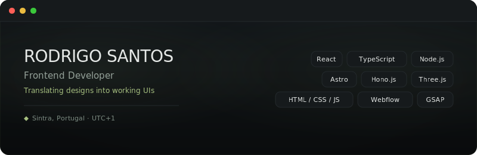

---

### Client work

[**GBuilder**](https://www.gbuilder.com/) — SaaS marketing site for a real estate BIM platform. Product pages, customer stories, interactive UI.

[**t'works**](https://www.t-works.eu/) — Global language services corporate site. Multi-language, large CMS architecture, service catalog.

[**Waymark**](https://www.waymarkcare.com/medicaid-transformation-report) — Data-rich annual report landing page. Healthcare statistics, charts, PDF download flow.

[**XetHub**](https://xethub-staging.webflow.io/) — ML versioning platform homepage. Modern tech startup site with integrations, use cases, and pricing.

### Side projects

[**book-buddy**](https://github.com/Rodsantos1337/book-buddy) — React + TypeScript app that lets an LLM search Open Library via API.

[**Zen-Boost**](https://github.com/Rodsantos1337/Zen-Boost) — Vanilla JS browser extension for the Zen Browser (Firefox-based).

---

- 9 freelance projects shipped on Upwork · 5.0 ★ · 100% Job Success
- Based in Sintra, Portugal · Open to remote roles
- **rod.santos122@gmail.com** · [LinkedIn](https://linkedin.com/in/rodrigo-santos122)

